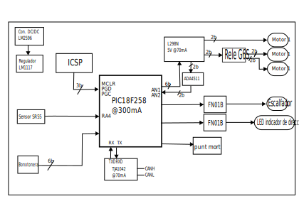

View this project on [CADLAB.io](https://cadlab.io/project/28966). 

# DIMECRES_C_retrovisors
## Autors
- Nom 1 (@RaulRoGue)
- Nom 2 (@inesquiot)
## Versió - v1.0 ## Curs - Assignatura de Disseny de PCBs amb KiCad - [Curs 2024-2025]

## Objectiu
Dissenyar una placa de circuit imprès (PCB) capaç de gestionar diverses funcions relacionades amb el retrovisor d’un vehicle. Aquesta PCB ha d’incloure les següents característiques:

- Control del plegament i desplegament del retrovisor, mitjançant motors elèctrics que permetin modificar-ne la posició de manera automàtica.

- Ajust de l'orientació del mirall, també motoritzat, per adaptar-lo segons les necessitats del conductor.

- Integració d’un sensor de detecció de punts morts, que alerti el conductor de la presència de vehicles o obstacles en zones de visibilitat reduïda.

- Incorporació d’un sistema de calefacció, per evitar l'entelament del mirall en condicions de fred o humitat.

- Implementació d’una llum indicadora de direcció, sincronitzada amb els intermitents del vehicle per millorar la visibilitat i la seguretat en maniobres.

## Requisits i especificacions
- 3 motors (moviment de mirall vertical i horitzontal, i plegat del retrovisor) amb
els seus finals de carrera.
- Calefactor del mirall.
- Sensor digital de detecció d’angle mort i llum indicadora.

## Diagrama de blocs

## Taula de components
| Descripció | Manufacturer Number | Package | Datasheet | Proveïdor | Unitats |
|------------|--------------------|---------|----------|----------|---------|
| Driver | L298N | Multipower15 | [Enllaç](https://www.mouser.es/datasheet/2/389/l298-1849437.pdf) | Mouser | 1 |
| Microcontrolador|PIC18F4480|SOIC-28|[Enllaç](https://www.mouser.es/datasheet/2/268/41159e-3443038.pdf)| Mouser | 1 |
| CAN Transceiver|TJA1042T/3/CM,118| Soic-8 |[Enllaç](https://www.mouser.es/datasheet/2/302/TJA1042-3103146.pdf)| Mouser | 1 |
| Rele SPDT| FN01B | | [Enllaç](https://docs.rs-online.com/df01/0900766b8158318b.pdf) | RS Amidata | 2 | 
| Rele DPDT | G6S-2F| | [Enllaç](https://docs.rs-online.com/f19f/0900766b813679a7.pdf) | Rs Amidara | 1 | 
| OpAmp | ADA4511-2 | Soic-8 |[Enllaç](https://www.analog.com/media/en/technical-documentation/data-sheets/ada4511-2.pdf) | Analog Devices | 1 |
| Conv. DC/DC Buck | LM2596 | TO-263  | [Enllaç](https://www.ti.com/lit/ds/symlink/lm2596.pdf?ts=1742644968953&ref_url=https%253A%252F%252Fwww.ti.com%252Fproduct%252Fes-mx%252FLM2596) | Texas Instruments | 1 | 
| Regulador 5V | LT1117-5 | TO-252 | [Enllaç](https://www.ti.com/lit/ds/symlink/lm1117.pdf?ts=1742626115453&ref_url=https%253A%252F%252Feu.mouser.com%252F) | Texas Instruments | 1 |
| Diode Schottky | SS3P5 | SMP | [Enllaç](https://www.vishay.com/docs/88997/ss3p5.pdf)| Mouser | 1 | 
| Transistors BJT | DTC144EE-TP |  SOT523 | [Enllaç](https://eu.mouser.com/datasheet/2/258/DTC144EE_SOT_523_-3422355.pdf) | Mouser | 3 | 
| Sensor | CH201 | | [Enllaç](https://www.mouser.com/catalog/specsheets/TDK_10012020_DS-000379-CH201-v1.1.pdf?_gl=1*1hqi1zx*_gcl_aw*R0NMLjE3NDI5MTUyMTYuQ2owS0NRanc0djYtQmhEdUFSSXNBTHBybTMzcE15Sndnb2ZsUDhyU0hKRnlfdW96UDFVbDk0eHJyYVVfRHJ2cTFwWWpSSVZXbWplNlU1c2FBanUxRUFMd193Y0I.*_gcl_au*MjA5Mjk5OTQ4Mi4xNzQwNTE4MTMx*_ga*NzY5MTk2MTM5LjE3NDA1MjAxNTA.*_ga_15W4STQT4T*MTc0Mjk0MjUwMy4yMC4xLjE3NDI5NDMzODEuNTguMC4w) | Mouser | 1 |
| Regulador 1.8V | ADM7160 | 5-TSOT | [Enllaç](https://www.analog.com/media/en/technical-documentation/data-sheets/ADM7160.pdf) | Analog Devices | 1 |
| Diodes Circulació | 1N5817 | DO-41 | [Enllaç](https://www.mouser.es/datasheet/2/389/1n5817-1848842.pdf) | Mouser | 3 | 
## Funcionalitats
- [ ] Funció 1
- [ ] Funció 2
- [ ] Funció 3

## Historial de canvis 
| Data | Autor | Branch | Descripció |
|------|------|--------|------------| 
| 2025-03-20 | Raul | `main` | Creació del projecte |
| 2025-03-21 | Raul | `main` | Llista materials | 
| 2025-03-23 | Raul | `main` | Sch. Regulador+Driver |
| 2025-03-23 | Ines | `main` | Sch. Microcontrolador |
| 2025-03-25 | Raul | `main` |Act. Sch. |
| 2025-03-29 | Raul | `main` | Sch. Def. |