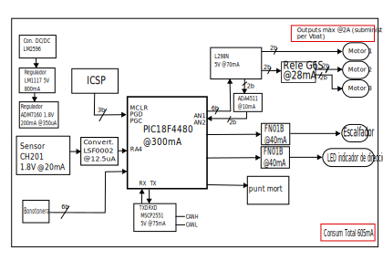

View this project on [CADLAB.io](https://cadlab.io/project/28966). 

# DIMECRES_C_retrovisors
## Autors
- Nom 1 (@RaulRoGue)
- Nom 2 (@usuariGitHub)
## Versió - v1.0 ## Curs - Assignatura de Disseny de PCBs amb KiCad - [Curs 2024-2025]

## Objectiu
Dissenyar una pcb que controli el plegament/desplegament del retrovisor, l'ajust del mirall amb motors,
la pcb també ha d'incloure un sensor que detecti els punts morts, un calefactor per evitar l'entelament
i una llum indicadora de direcció.

## Requisits i especificacions
- 3 motors (moviment de mirall vertical i horitzontal, i plegat del retrovisor) amb
els seus finals de carrera.
- Calefactor del mirall.
- Sensor digital de detecció d’angle mort i llum indicadora.

## Diagrama de blocs (Afegiu una imatge del diagrama de blocs)

## Taula de components
| Descripció | Manufacturer Number | Package | Datasheet | Proveïdor | Unitats |
|------------|--------------------|---------|----------|----------|---------|
| Driver | L298N | Multipower15 | [Enllaç](https://www.mouser.es/datasheet/2/389/l298-1849437.pdf) | STMicroelectronics | 1 |
| Microcontrolador|PIC18F258|SOIC-28|[Enllaç](https://www.mouser.es/datasheet/2/268/41159e-3443038.pdf)|Microchip Technology| 1 |

## Funcionalitats
- [ ] Funció 1
- [ ] Funció 2
- [ ] Funció 3

## Historial de canvis 
| Data | Autor | Branch | Descripció |
|------|------|--------|------------| 
| 2025-03-20 | Raul | `main` | Creació del projecte |